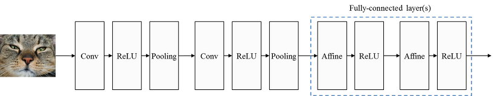
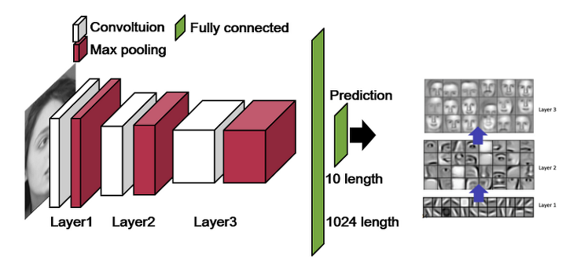

**이 글은 다음 블로그[(라온피플)](https://laonple.blog.me/220608018546)를 보고 정리하며 공부한 내용입니다.**

## **CNN의 구조와 처리 과정**

> **Input - Feature Extraction - Shift and distortion invariance - Classification - Output**

> **인풋 이미지 - 특징 추출 - topology 변화에 영향을 받지 않도록 하는 단계 - 분류기 - 아웃풋**

CNN에 특징을 추출하는 단계가 포함되어 있어 raw image에 대해 직접 operation이 가능하며 기존 알고리즘과 달리 별도의 전처리 단계가 필요하지 않다.

특징 추출과 **topology invariance**를 얻기 위해 **filter와 sub-sampling**을 거친다. 이 과정을 여러번 반복적으로 수행하여 local feature로부터 **global feature**를얻어낸다. (convolution층과 (max)pooling층을 반복적으로 쌓음으로써 global feature를 얻어낸다. )

대부분의 영상인식 알고리즘에는 **특징을 추출하기 위해 filter를 사용**한다. 보통 필터는 5x5 혹은 3x3과 같은 작은 영역(receptive field)에 대해 적용하며 필터에 사용에는 **계수들의 값에 따라 다른 특징**을 얻을 수 있다. (opencv 실습을 해보면 알 수 있음)

**CNN에서 사용하는 filter 혹은 convolutional layer는 학습을 통해 최적의 계수를 결정할 수 있게 하는 점이 다르다.** 

subsampling은 고정된 위치에 있는 픽셀을 고르거나 subsampling window 안에 있는 픽셀들의 평균을 취한다. CNN에서는 (보통?) **Maxpooling 방식**의 subsampling 과정을 거친다. subsampling window 안에 있는 픽셀들 중 가장 큰 값을 선택한다. 

**이동이나 변형 등에 무관한 학습 결과를 보이려면 (변화에 민감하지 않으려면) ****더 강하고 global한 특징을 추출해야한다. **이를 위해 Convolution과 Subsampling 과정을 여러 번 거친다. 

이 특징을 Fully-Connected Network(FCN)를 통해 학습시키게 되면 2차원 영상정보로부터 receptive field와 강한 신호 선택의 특성을 살려 topology(위상?) 변화에 강인한 인식 능력을 갖게된다. 

