Faster R-CNN은 영상 안의 여러 사물을 한꺼번에 분류하고, 데이터 학습에 따라 겹쳐있는 부분들까지도 정확하게 사물들을 분류해낼 수 있다.

## **Architecture**

두 개의 네트워크로 구성됨

1.  Deep Convolution Network로서 Region Proposal Network
    
2.  Faster R-CNN Detector로서 앞의 proposed regions를 사용하여 객체 감지
    

이 두 모듈은 전체적으로 하나의 object detection network라고 볼 수 있음

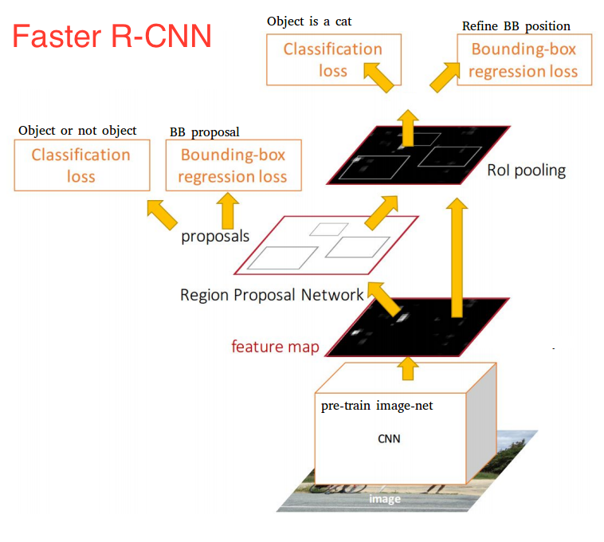

### Input Images

높이\*너비\*깊이를 가지고 있는 텐서이다. (RGB 이미지)

### Base Network (Shared Network)

-   #### Name Meaning
    

이전 R-CNN에서는 Region proposal을 하기 위해 selective search를 사용했다. Selective search를 통해서 나온 수천개 각각의 region proposals마다 CNN을 사용하여 forward pass(이게뭐지?)를 하였다. 또, feature를 뽑아내는 CNN, 어떤  class인지 알아내는 classifier, bounding boxes를 예측하는 regression model을 각각 학습시켜야 했다. 

Fast R-CNN에서는 중복되는 연산을 하나의 CNN으로 해결한다. 이미지를 받아서 feature를 뽑아내는 일을 하기 때문에 base network라고 한다. 또는 중복되는 일을 하나의 CNN에서 처리하기 때문에 shared network라고도 한다. 

-   #### How it works
    

Base Network가 하는 일은 이미지 대한 feature extraction(특징 추출)이다. 중요한 포인트는 이미 학습되어있는 모델을 사용해야 한다는 것이다. (Transfer Learning과 유사)

모델은 주로 기존의 모델을 사용한다. ResNet, VGG, Google의 Inception 등 다양하게 사용할 수 있다. 하지만 찾고자하는 object의 feature를 뽑아야하기 때문에 해당 object를 학습해놓아야 한다.  

### 

### RPNs(Region Proposal Networks) 

-   #### Name Meaning
    

RPN은 Convolution을 사용하여 구현되며, input 값은 이전 base network에서 뽑아낸 feature map을 사용한다. Region proposal을 생성하기 위해서는 base network에서 생성한 feature maps 위에 n \* n spatial window를 슬라이드 시킨다. 

각각의 sliding-window가 찍은 지점마다, 한번에 여러개의 region proposals을 예측하게 된다. Region proposals의 최고 갯수는 k로 나타내고, 이것을 Anchor라고 부른다.

보통 각 sliding window의 지점마다 9개의 anchors가 존재하며, 3개의 서로 다른 종횡비(aspect ratios), 3개의 서로 다른 크기가 조합되며 모두 동일한 중앙지점을 가지고 있다.  

(( 무슨말인지 이해가 안되는데.. sliding window가 찍는다는건 일단 sliding window의 중심으로 찍는다는 것인가? 그리고 그 중심을 중심으로 하여 여러개의 region proposals을 찾고 이것은 anchor boxes를 말하는 것? 3개의 서로 다른 종횡비라는 것은 서로 다른 가로, 세로 길이가 조합되어 3\*3=9개 anchor를 갖게되는 것.. 맞나?))

Sliding window를 통해 나온 feature map의 depth는 더 낮은 차원이 된다. (이건 또 왜?) 이후의 output 값은 1 \* 1 kernel을 갖고있는 두 개의 convolutional layers로 양분되어 들어가게 된다. 

Classification Layer에서는 anchor당 2개의 predictions 값을 내놓으며, 객체인지 아니면 객체가 아닌지에 관한 확률값이다.

Regression Layer (또는 Bounding box adjustment layer)는 각 anchor당 델타 값들 4개의 값을 내놓는다. 이 델타 값들은 anchors에 적용되어서 최종 proposals을 얻게된다. 

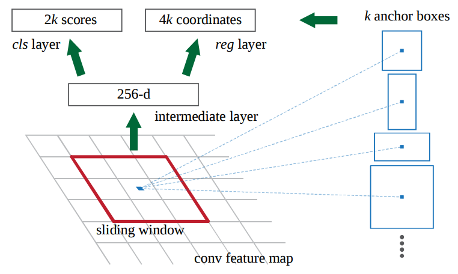

-   #### Classifier of Background and Foreground
    

Classifier를 학습시키기 위한 training data는 RPN에서 얻은 anchors와 ground-truth boxes(실제 사람이 직접 박스처리한 데이터)이다. 

모든 anchors를 foreground인지 background인지 분류해야한다. 분류 기준은 어떤 anchor가 ground truth box와 오버랩되는 부분이 크냐이다. 오버랩되는 부분이 크면 foreground(object)이고 적으면 background(객체 아님, 배경)이다. 각각의 anchor마다 foreground인지 아니면 background인지 구별하는 값을 p\* 값이라고 했을 때 공식은 다음과 같다. 

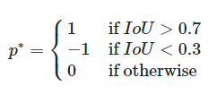

여기서 IoU(Intersection over Union)은 다음과 같이 정의된다.

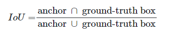

일반적으로 IoU 값이 가장 높은 값을 1 값으로 잡으면 되지만 잘 잡히지 않는 경우 0.7로 하면 된다. 하나의 ground-truth box는 여러개의 anchors에  1 값을 줄 수 있다. 0.3 이하의 값으로 떨어지는 anchor는 -1 값을 준다. 그 외 IoU 값이 높지도 낮지도 않은 anchors들 같은 경우는 학습시 사용되지 않는다. (0.7, 0.3은 임의로 정한 값)

-   Bounding box regression
    

bounding box regression에는 4개의 좌표값을 사용한다. t라는 값 자체가 4개의 좌표값을 갖고 있는 하나의 벡터라고 보면 된다. 다음과 같은 element 값을 가지고 있다. 

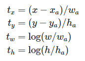

ground-truth vector t\*에는 위와 유사하게 다음과 같은 값을 가지고 있다. 

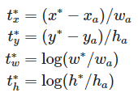

-   tx,ty : 박스의 center coordinates
    
-   tw,th  : 박스의 width, height
    
-   x,y,w,h : predicted box
    
-   xa,ya,wa,ha : anchor box
    
-   x\*,y\*w\*,h\* : ground-truth box
    

### 

### Region of Interest Pooling

RPN 이후, 서로 다른 크기의 proposed regions 값을 output으로 받는다. 서로 다른 크기라는 말은 CNN에서 output으로 나온 feature maps가 제각각 다른 크기라는 뜻이다. 특히 일반적으로 feature maps를 flatten 시켜서 딥러닝을 태워서 추후에 classification을 할 때는 더 어렵게 된다. 

이 때 사용하는 기법이 Region of Interest Pooling(ROI Pooling) 기법이다. ROI를 사용하면 서로 다른 크기의 feature maps을 동일한 크기로 변환시켜줄 수 있다. 

-   How it works
    

ROI를 구현하기 위해서는 2개의 input이 필요하다.

1.  Deep Convolutions, Max Pooling Layers에서 나온 feature map
    
2.  N x 4 매트릭스 - N은 ROI의 갯수, 4는 region의 위치를 나타내는 Coordinates
    

ROI 로직

1.  각각의 region proposal을 동일한 크기의 sections로 나눈다.
    
2.  각각의 section마다 가장 큰 값을 찾는다.
    
3.  각각의 찾은 maximum 값을 output으로 만든다. 
    

예를 들어, 다음과 같은 8x8 형태의 feature map이 있다고 하자.

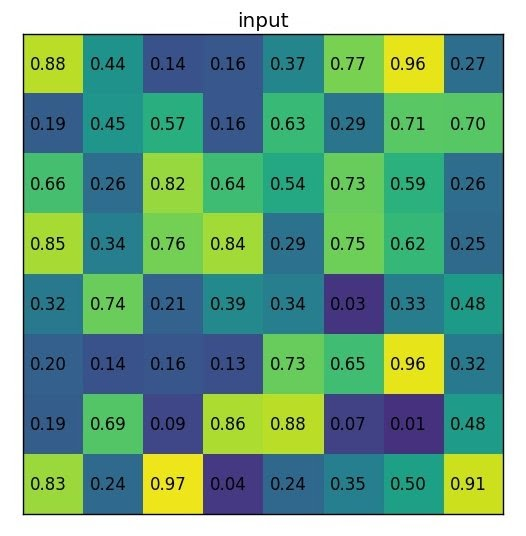

region-proposal의 값은 (0,3), (7,8)일 때 다음과 같다.

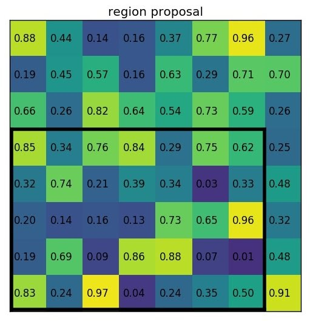

section의 크기는 2x2로 region proposal을 아래와 같이 나눈다.

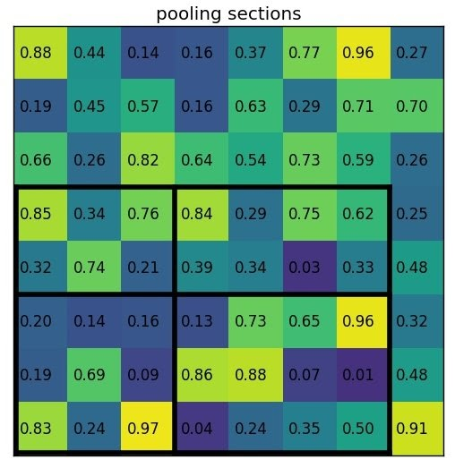

section의 크기가 모두 동일할 필요는 없다. 다만 크기가 거의 동일하면 된다.

Max value 값을 내면 다음과 같은 output이 생성된다. (이게 Max Pooling 말하는거지?)

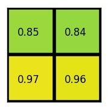

(RoI Pooling을 사용할 수도 있지만 더 쉬운 Fixed-size Resize instad of RoI Pooling이 있다.)

### Training

#### Loss Function 
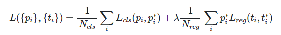

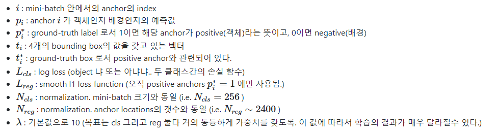

-   #### Training RPN
    

하나의 이미지에서 random으로 256개(batch 크기)의 anchors를 샘플링한다. 이 때, positive anchors(객체)와 negative anchors(배경)의 비율은 1:1이 되도록 한다. 만약 랜덤으로 진행시, negative anchors 갯수가 더 많아서 학습이 편향될 수 있다.

하지만 현실적으로 1:1 비율을 유지하는 것은 어렵다. 대부분 positive samples의 갯수가 128개를 넘지 못하는 경우인데, 이 경우 제로패딩을 시켜주거나 아예 없는 경우 IoU 값이 가장 높은 값을 사용하기도 한다.

### Processing Tips

#### Non-Maximum Suppression

Faster R-CNN에 대한 학습이 완료된 후, RPN 모델을 예측시키면 한 객체당 여러 개의 proposals(bounding boxes)을 얻을 것이다. anchors 자체가 어떤 객체에 중복되기 때문에 proposal 또한 여러개가 되는 것이다. 

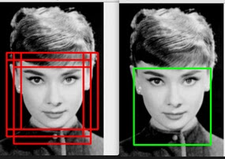

문제를 해결하기 위해 non-maximum suppression(NMS) 알고리즘을 사용해서 proposal의 갯수를 줄이도록 한다. NMS는 IoU 값으로 proposal을 모두 정렬하고 RoI 점수가 가장 높은 proposal과 다른 proposal에 대해서 overlapping을 비교한 뒤 overlapping이 높은 것은 특정 threshold 이상이면 proposals에서 삭제하는 방식이다. 그러면 서로 오버랩되지 않으며 RoI가 높은 proposal만 남게된다.

일반적인 threshold 값: 0.6~0.9

#### RoI-Removed Model

만약 구분해야될 클래스가 1개밖에 없을 때는 RPN만 사용해서 구현이 가능하다. 객체인지 배경인지 구분하는 classifier 자체를 사용해서 클래스를 구별해주면 된다. 

#### Fixed-size Resize instead of ROI Pooling

 RoI Pooling 대신 object detection을 실제 구현할 때 더 많이 쓰이고 쉬운 방법이 있다. 각각의 convolution feature map을 각각의 proposal로 crop시킨 뒤, cropped image를 고정된 크기 14\*14\*depth로 interpolation을 사용하여 resize시킨다. 이후 2x2 kernel을 사용하여 7\*7\*depth 형태의 feature map으로  max pooling 시켜준다. 

**Reference**

[http://incredible.ai/deep-learning/2018/03/17/Faster-R-CNN/](http://incredible.ai/deep-learning/2018/03/17/Faster-R-CNN/)  

[incredible.ai](http://incredible.ai/deep-learning/2018/03/17/Faster-R-CNN/)

[https://zzsza.github.io/data/2018/05/09/Faster-RCNN-review/](https://zzsza.github.io/data/2018/05/09/Faster-RCNN-review/)

[zzsza.github.io](https://zzsza.github.io/data/2018/05/09/Faster-RCNN-review/)
