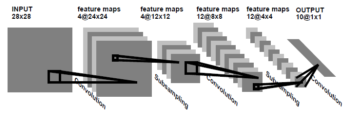

  
**Yann LeCun (얀 르쿤)** 의 "Gradient-based learning applied to document recognition" 논문에서 손글씨 숫자 인식하는데 문제를 해결하기 위해 사용된 모델

  
기존의 Fully-Connected Neural Network가 가지고 있는 한계를 이해하고 이것을 개선하기 위해 연구 시작

 Fully Connected Layer (완전연결계층)을 이용해 MNIST 데이터셋을 분류하는 모델을 만들 때 3차원인 MNIST 데이터 (28,28,1)를 input으로 넣어주기 위해 3차원을 1차원의 평평한(flat) 데이터로 펼쳐줘야 했다. 즉, 28 \* 28 \* 1 = 784의 1차원 데이터로 바꾸어 입력층에 넣어주었다. 

 이미지 데이터는 3차원의 형상을 가지며, 이 형상에는 공간적 구조(spatial structure)를 가진다. Fully Connected Layer의 문제점은 바로 데이터의 형상(topology)이 무시된단는 것이다.

따라서 이전 글에서 살펴본 것 처럼 **Local receptive field, Shared weight, Sub-sampling**의 개념을 결합한 **Convolutional Neural Network(CNN)를 개발**하게 된다. 

LeNet-1이 개발된 후 이를 바탕으로 LeNet-5가 개발되었다. Convolution kernel(filter)의 개수를 늘리고 최종단에 있는 Fully-connected layer의 크기도 커졌다. 

#### LeNet-1과 LeNet-5의 구조는 다음과 같다.

### **LeNet-5의 구조**

> input - C1 - S2 - C3 - S4 - C5 - F6 - output 

-   input layer
-   conv layer (C1,C3, C5) 3개
-   subsampling layer (S2, S4) 2개
-   full-connected (F6)

C1~F6 Layers 활성화 함수는 **tanh**

-   **C1 Layer**

입력 영상(32x32)을 6개의 필터(5x5)와 컨볼루션 연산을 한다. 그 결과 6장의 28x28 피쳐맵을 얻는다. 피쳐맵이 6장인 이유는 각 필터마다 피쳐맵이 나오기 때문이고, 사이즈는 32에서 28로 줄어든 이유는 패딩처리를 하지 않았기 때문이다. 

-   **S2 Layer**

Average Pooling으로 Subsampling한다. 2x2 필터를 stride 2로 설정하여 Feature map이 반(14x14)으로 축소한다. 

-   **C3 Layer**

결과적으로는 6장의 14x14 피쳐맵으로터 16장의 10x10 피쳐맵을 산출해낸다.

6개의 모든 피쳐맵이 16개의 필터처리 하는 것이 아니라 다음 테이블과 같이 선택적으로 입력 영상을 선택하여 반영하였다. 그 이유는 연산량의 크기를 줄이고, 연결의 symmetry를 깨줌으로써 처음 convolution으로부터 얻은 6개의 low-level feature가 서로 다른 조합으로 섞이며 global feature로 나타나기를 기대하기 때문이다. 

아래 표에서  보면 1열의 값들 0~5는 S2 Layer에서의 피쳐맵들이고, 1행의 0~15는 16장의 필터를 뜻한다. 

예를 들면,

     ▶  0, 1, 2번 피쳐맵이 묶여 0번 필터로 처리되고

▶ 0, 1, 2, 3번 피쳐맵이 묶여 6번 필터로 처리되는 것이다. 

-   **S4 Layer**

S2와 마찬가지로 subsampling 단계이고, 10x10 피쳐맵 영상을  5x5 영상으로 만든다. 

-   **C5 Layer**

16개의 5x5 영상을 받아, 5x5 kernel 크기의 convolution을 수행하기 때문에 출력은 1x1 크기의 feature map이다.

이것들을 Fully Connected 형태로 연결하여 총 120개의 feature-map을 생성한다. 이전 단계의 16개의 feature-map이 convolution을 거치며 다시 전체적으로 섞이는 결과를 내게 된다. 

-   **F6 Layer**

Fully Connected이며 C5의 결과를 84개의 unit에 연결시킨다. 

**Reference**

[https://excelsior-cjh.tistory.com/180](https://excelsior-cjh.tistory.com/180)

[https://bskyvision.com/418](https://bskyvision.com/418)

[
bskyvision.com
](https://bskyvision.com/418)

[http://www.hellot.net/new\_hellot/magazine/magazine\_read.html?code=205&idx=42920&public\_date=2018-10](http://www.hellot.net/new_hellot/magazine/magazine_read.html?code=205&idx=42920&public_date=2018-10)

[
www.hellot.net

](http://www.hellot.net/new_hellot/magazine/magazine_read.html?code=205&idx=42920&public_date=2018-10)
